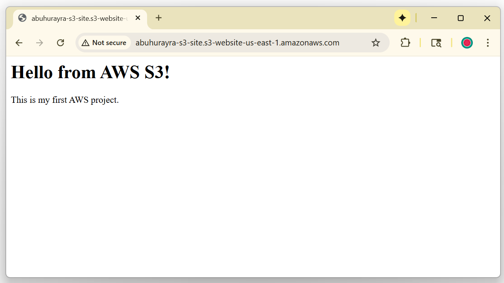

# ☁️ Project 1: Static Website on AWS S3

## 🧭 Overview
This project demonstrates how to host a simple static website on Amazon S3 using public access and static website hosting.  
It’s my first hands-on AWS project as part of my cloud journey.

## 🛠️ Steps
1. Created S3 bucket (`abuhurayra-s3-site`)
2. Disabled "Block all public access"
3. Uploaded `index.html` and `error.html`
4. Added a public bucket policy for read-only access
5. Enabled static website hosting
6. Verified the site via the S3 public endpoint

## 🌐 Live Demo
`http://abuhurayra-s3-site.s3-website-us-east-1.amazonaws.com/`

## 📸 Screenshot

## 🧠 Skills Learned
- S3 bucket management
- Static web hosting
- IAM & bucket policies
- Public access control

## 🧹 Next Step
Re-enabled public access blocking after verifying site.
